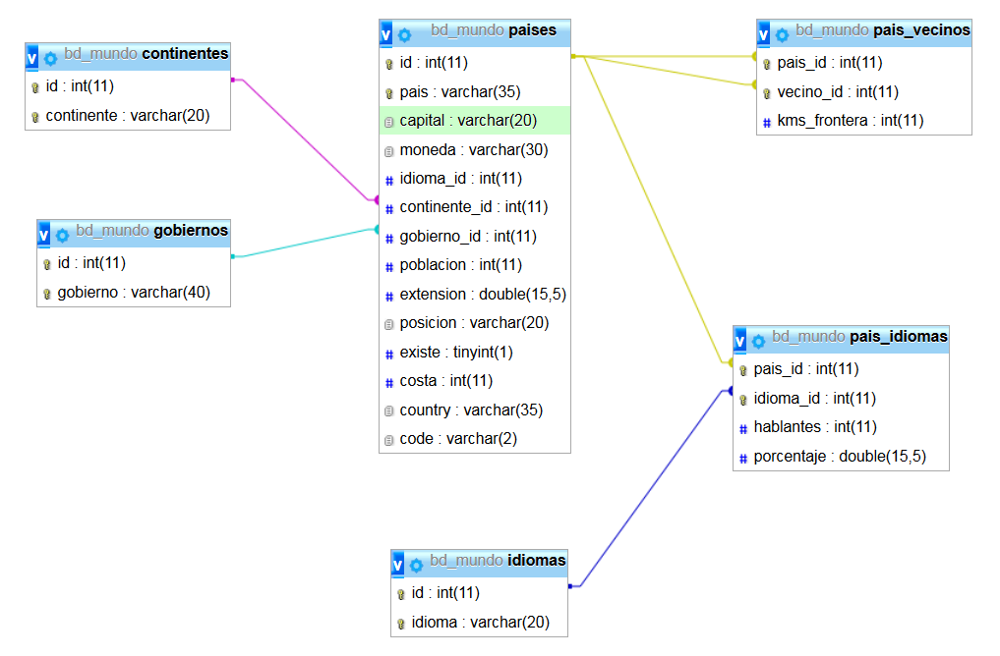

Ejercicios en bd_mundo
======================

  1. Muestra el nombre del país y del continente de todos los países.
  2. Muestra todos los países que tienen el campo posición (no es nulo).
  3. Muestra el nombre del país y el gobierno de todos los países.
  4. Muestra el nombre del país, su capital y la moneda de todos los países.
  5. Haz el total de población y extensión de todos los países.
  6. Calcula el número de países y el promedio de población y de extensión.
  7. Muestra el total de población agrupado por continente.
  8. Muestra la cuenta de países y el total de extension agrupado por gobierno.
  9. Muestra el total de población agrupado por continente y gobierno.
  10. Muestra el número de países y el total de población agrupado por la primera letra del país.

---

  11. Muestra los idiomas hablados en cada país.
  12. Muestra los países fronterizos de cada país.
  13. Muestra el número de idiomas hablados en cada país.
  14. Muestra los idiomas hablados en cada país de África.
  15. Muestra los países del mundo donde se hablan al menos 4 idiomas.
  16. Muestra una lista de idiomas y el número de países que lo hablan.
  17. Muestra el número de idiomas hablado en cada continente.
  18. Muestra los países donde se habla catalán.
  19. Muestra los países donde se habla francés o alemán.
  20. Muestra los idiomas de los 5 países más grandes.

---
